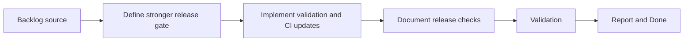

## task_020_harden_release_gating_packaging_and_runtime_validation - Harden release gating packaging and runtime validation
> From version: 3.0.0
> Status: Done
> Understanding: 100%
> Confidence: 98%
> Progress: 100%
> Complexity: Medium
> Theme: Reliability
> Reminder: Update status/understanding/confidence/progress and dependencies/references when you edit this doc.

# Context
- Derived from backlog item `item_014_harden_release_gating_packaging_and_runtime_validation`.
- Source file: `logics/backlog/item_014_harden_release_gating_packaging_and_runtime_validation.md`.
- Related request(s): `req_015_harden_release_gating_packaging_and_runtime_validation`.

# Plan
- [x] 1. Define the stronger minimal release gate needed after the rewrite slices land, including packaging, startup, core-flow, and runtime-sensitive validation surfaces.
- [x] 2. Implement the necessary validation scripts, CI updates, and smoke checks to enforce that release gate locally and in CI.
- [x] 3. Document the release checks and the late-phase runtime validation expectations, then validate the new gate end to end.
- [x] FINAL: Update related Logics docs

# AC Traceability
- AC1 -> Step 1 and Step 2. Proof: stronger release-gating rules and validation coverage.
- AC2 -> Step 2 and Step 3. Proof: improved release confidence without behavior changes.
- AC3 -> FINAL. Proof: updated `logics` docs and regular commits.

# Links
- Backlog item: `item_014_harden_release_gating_packaging_and_runtime_validation`
- Request(s): `req_015_harden_release_gating_packaging_and_runtime_validation`
- Orchestration task: `task_004_orchestrate_incremental_rewrite_execution_governance_and_validation`

# Validation
- `bash validate.sh`
- `python3 logics/skills/logics-doc-linter/scripts/logics_lint.py`
- `python3 -m unittest discover -s tests -p "test_*.py" -v`
- `node --test tests/test_utils.mjs`
- run any new release-gate smoke checks added by this slice

# Definition of Done (DoD)
- [x] Scope implemented and acceptance criteria covered.
- [x] Validation commands executed and results captured.
- [x] Linked request/backlog/task docs updated.
- [x] Status is `Done` and progress is `100%`.

# Report
- Hardened the local and CI release gate around a single `bash validate.sh` entry point.
- Strengthened packaging by making `build.sh` ship runtime files only instead of zipping the whole repository.
- Added `scripts/release_gate.py` to validate the produced archive against `manifest.json` and reject non-runtime files in the release zip.
- Added smoke coverage for startup hook wiring in `tests/test_setup.mjs`.
- Extended Python validation coverage with `tests/test_release_gate.py` and expanded `scripts/validate_manifest.py` to require the new architecture modules.
- Documented the release gate and deferred late runtime checks in `README.md`.
- Validation executed:
- `bash validate.sh`
- `python3 logics/skills/logics-doc-linter/scripts/logics_lint.py`
- `python3 logics/skills/logics-flow-manager/scripts/workflow_audit.py`
