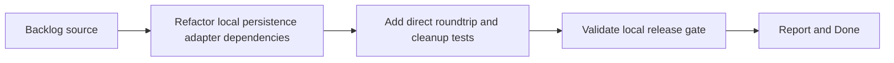

## task_021_harden_local_persistence_adapter_behavior_and_test_coverage - Harden local persistence adapter behavior and test coverage
> From version: 3.0.1
> Status: Done
> Understanding: 100%
> Confidence: 98%
> Progress: 100%
> Complexity: Medium
> Theme: Reliability
> Reminder: Update status/understanding/confidence/progress and dependencies/references when you edit this doc.

# Context
- Derived from backlog item `item_016_harden_local_persistence_adapter_behavior_and_test_coverage`.
- Source file: `logics/backlog/item_016_harden_local_persistence_adapter_behavior_and_test_coverage.md`.
- Related request(s): `req_017_harden_local_persistence_adapter_behavior_and_test_coverage`.

# Plan
- [x] 1. Refactor `modules/localStorage.mjs` only as needed to make its dependencies explicit and remove dead helper paths.
- [x] 2. Add direct tests for compressed export roundtrip, changelog roundtrip, raw fallback storage, and cleanup behavior.
- [x] 3. Validate the slice through local tests, `validate.sh`, and `logics` audits.
- [x] FINAL: Update related Logics docs

# AC Traceability
- AC1 -> Step 1. Proof: adapter dependencies clarified and dead helper paths removed.
- AC2 -> Step 2 and Step 3. Proof: direct persistence tests added and passing.
- AC3 -> Step 1 and Step 3. Proof: unchanged key strategy and green validation.

# Links
- Backlog item: `item_016_harden_local_persistence_adapter_behavior_and_test_coverage`
- Request(s): `req_017_harden_local_persistence_adapter_behavior_and_test_coverage`

# Validation
- `node --test tests/test_local_storage.mjs`
- `bash validate.sh`
- `python3 logics/skills/logics-doc-linter/scripts/logics_lint.py`
- `python3 logics/skills/logics-flow-manager/scripts/workflow_audit.py`

# Definition of Done (DoD)
- [x] Scope implemented and acceptance criteria covered.
- [x] Validation commands executed and results captured.
- [x] Linked request/backlog/task docs updated.
- [x] Status is `Done` and progress is `100%`.

# Report
- Added explicit dependency creation to `modules/localStorage.mjs` so the adapter can be tested directly without a full module manager.
- Removed dead helper paths from the adapter and kept the existing character-scoped key strategy unchanged.
- Added direct tests for compressed export roundtrip, changelog history roundtrip, raw fallback storage, and cleanup behavior in `tests/test_local_storage.mjs`.
- Validation executed:
- `node --test tests/test_local_storage.mjs`
- `bash validate.sh`
- `python3 logics/skills/logics-doc-linter/scripts/logics_lint.py`
- `python3 logics/skills/logics-flow-manager/scripts/workflow_audit.py`
