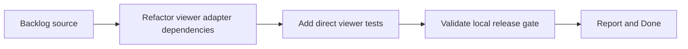

## task_024_harden_viewer_adapter_behavior_and_test_coverage - Harden viewer adapter behavior and test coverage
> From version: 3.0.1
> Status: Done
> Understanding: 100%
> Confidence: 97%
> Progress: 100%
> Complexity: Low
> Theme: Reliability
> Reminder: Update status/understanding/confidence/progress and dependencies/references when you edit this doc.

# Context
- Derived from backlog item `item_019_harden_viewer_adapter_behavior_and_test_coverage`.
- Source file: `logics/backlog/item_019_harden_viewer_adapter_behavior_and_test_coverage.md`.
- Related request(s): `req_020_harden_viewer_adapter_behavior_and_test_coverage`.

# Plan
- [x] 1. Refactor `modules/viewer.mjs` only as needed to clarify dependencies and remove self-referential calls.
- [x] 2. Add direct tests for popup creation, clipboard copy success/error, file sharing, and Hastebin success/error branches.
- [x] 3. Validate the slice through local tests, `validate.sh`, and `logics` audits.
- [x] FINAL: Update related Logics docs

# AC Traceability
- AC1 -> Step 1. Proof: dependencies clarified and self-referential calls removed.
- AC2 -> Step 2 and Step 3. Proof: direct viewer tests added and passing.
- AC3 -> Step 1 and Step 3. Proof: unchanged visible behavior and green validation.

# Links
- Backlog item: `item_019_harden_viewer_adapter_behavior_and_test_coverage`
- Request(s): `req_020_harden_viewer_adapter_behavior_and_test_coverage`

# Validation
- `node --test tests/test_viewer.mjs`
- `bash validate.sh`
- `python3 logics/skills/logics-doc-linter/scripts/logics_lint.py`
- `python3 logics/skills/logics-flow-manager/scripts/workflow_audit.py`

# Definition of Done (DoD)
- [x] Scope implemented and acceptance criteria covered.
- [x] Validation commands executed and results captured.
- [x] Linked request/backlog/task docs updated.
- [x] Status is `Done` and progress is `100%`.

# Report
- Added explicit dependency creation to `modules/viewer.mjs` and removed self-referential calls in Hastebin success/error branches.
- Added direct tests for popup creation, clipboard success/error, file sharing, and Hastebin success/error behavior in `tests/test_viewer.mjs`.
- Validation executed:
- `node --test tests/test_viewer.mjs`
- `bash validate.sh`
- `python3 logics/skills/logics-doc-linter/scripts/logics_lint.py`
- `python3 logics/skills/logics-flow-manager/scripts/workflow_audit.py`
