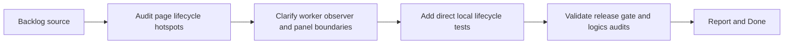

## task_025_harden_page_runtime_lifecycle_and_panel_worker_boundaries - Harden page runtime lifecycle and panel worker boundaries
> From version: 3.0.1
> Status: In progress
> Understanding: 96%
> Confidence: 95%
> Progress: 0%
> Complexity: Medium
> Theme: Reliability
> Reminder: Update status/understanding/confidence/progress and dependencies/references when you edit this doc.

# Context
- Derived from backlog item `item_020_harden_page_runtime_lifecycle_and_panel_worker_boundaries`.
- Source file: `logics/backlog/item_020_harden_page_runtime_lifecycle_and_panel_worker_boundaries.md`.
- Related request(s): `req_021_harden_page_runtime_lifecycle_and_panel_worker_boundaries`.

# Plan
- [ ] 1. Audit `modules/pages.mjs`, `pages/combatPanel.mjs`, and `pages/nonCombatPanel.mjs` to isolate the smallest safe lifecycle hardening seam.
- [ ] 2. Refactor only what is needed to clarify observer registration, worker refresh behavior, panel visibility rules, and notification/control-panel boundaries.
- [ ] 3. Add direct local validation for panel refresh, page matching, and injected visibility behavior.
- [ ] 4. Validate the slice through targeted tests, `validate.sh`, and `logics` audits.
- [ ] FINAL: Update related Logics docs

# AC Traceability
- AC1 -> Step 1 and Step 2. Proof: lifecycle responsibilities are clarified without widening scope.
- AC2 -> Step 3 and Step 4. Proof: direct local lifecycle tests added and passing.
- AC3 -> Step 2 and Step 4. Proof: preserved ETA panel behavior and green validation.

# Links
- Backlog item: `item_020_harden_page_runtime_lifecycle_and_panel_worker_boundaries`
- Request(s): `req_021_harden_page_runtime_lifecycle_and_panel_worker_boundaries`

# Validation
- `node --test tests/test_pages*.mjs tests/test_*panel*.mjs`
- `bash validate.sh`
- `python3 logics/skills/logics-doc-linter/scripts/logics_lint.py`
- `python3 logics/skills/logics-flow-manager/scripts/workflow_audit.py`

# Definition of Done (DoD)
- [ ] Scope implemented and acceptance criteria covered.
- [ ] Validation commands executed and results captured.
- [ ] Linked request/backlog/task docs updated.
- [ ] Status is `Done` and progress is `100%`.

# Report
- None yet.
