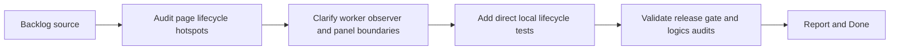

## task_025_harden_page_runtime_lifecycle_and_panel_worker_boundaries - Harden page runtime lifecycle and panel worker boundaries
> From version: 3.0.1
> Status: Done
> Understanding: 100%+
> Confidence: 98%
> Progress: 100%+
> Complexity: Medium
> Theme: Reliability
> Reminder: Update status/understanding/confidence/progress and dependencies/references when you edit this doc.

# Context
- Derived from backlog item `item_020_harden_page_runtime_lifecycle_and_panel_worker_boundaries`.
- Source file: `logics/backlog/item_020_harden_page_runtime_lifecycle_and_panel_worker_boundaries.md`.
- Related request(s): `req_021_harden_page_runtime_lifecycle_and_panel_worker_boundaries`.

# Plan
- [x] 1. Audit `modules/pages.mjs`, `pages/combatPanel.mjs`, and `pages/nonCombatPanel.mjs` to isolate the smallest safe lifecycle hardening seam.
- [x] 2. Refactor only what is needed to clarify observer registration, worker refresh behavior, panel visibility rules, and notification/control-panel boundaries.
- [x] 3. Add direct local validation for panel refresh, page matching, and injected visibility behavior.
- [x] 4. Validate the slice through targeted tests, `validate.sh`, and `logics` audits.
- [x] FINAL: Update related Logics docs

# AC Traceability
- AC1 -> Step 1 and Step 2. Proof: lifecycle responsibilities are clarified without widening scope.
- AC2 -> Step 3 and Step 4. Proof: direct local lifecycle tests added and passing.
- AC3 -> Step 2 and Step 4. Proof: preserved ETA panel behavior and green validation.

# Links
- Backlog item: `item_020_harden_page_runtime_lifecycle_and_panel_worker_boundaries`
- Request(s): `req_021_harden_page_runtime_lifecycle_and_panel_worker_boundaries`

# Validation
- `node --test tests/test_pages*.mjs tests/test_*panel*.mjs`
- `bash validate.sh`
- `python3 logics/skills/logics-doc-linter/scripts/logics_lint.py`
- `python3 logics/skills/logics-flow-manager/scripts/workflow_audit.py`

# Definition of Done (DoD)
- [x] Scope implemented and acceptance criteria covered.
- [x] Validation commands executed and results captured.
- [x] Linked request/backlog/task docs updated.
- [x] Status is `Done` and progress is `100%`.

# Report
- Added `modules/pagesRuntime.mjs` to centralize worker action matching, global-tick gating, control-state transitions, refresh throttling, and shared ETA panel shell rendering.
- Rewired `modules/pages.mjs` to use those helpers for worker matching, global event gating, position/size/visibility transitions, and the small-size refresh path.
- Rewired `pages/combatPanel.mjs` and `pages/nonCombatPanel.mjs` to use shared refresh throttling and shell rendering instead of duplicating that lifecycle logic inline.
- After the first in-game replay exposed Melvor loader incompatibility with relative ESM imports, rewired `setup.mjs`, `modules/pages.mjs`, `pages/combatPanel.mjs`, `pages/nonCombatPanel.mjs`, `modules/settingsDomain.mjs`, `modules/exportDomain.mjs`, and `modules/cloudStorage.mjs` back to loader-compatible dependency access.
- Added direct tests in `tests/test_pages_runtime.mjs` and `tests/test_panels.mjs`.
- Validation executed:
- `node --test tests/test_pages_runtime.mjs tests/test_panels.mjs`
- `bash validate.sh`
- `python3 logics/skills/logics-doc-linter/scripts/logics_lint.py`
- `python3 logics/skills/logics-flow-manager/scripts/workflow_audit.py`
