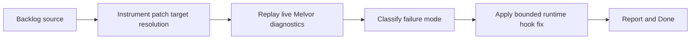

## task_026_diagnose_runtime_patch_target_resolution_for_eta_hooks - Diagnose runtime patch target resolution for ETA hooks
> From version: 3.0.8
> Status: Proposed
> Understanding: 92%
> Confidence: 95%
> Progress: 0%
> Complexity: Medium
> Theme: Reliability
> Reminder: Update status/understanding/confidence/progress and dependencies/references when you edit this doc.

# Context
- Derived from backlog item `item_021_diagnose_runtime_patch_target_resolution_for_eta_hooks`.
- Source file: `logics/backlog/item_021_diagnose_runtime_patch_target_resolution_for_eta_hooks.md`.
- Related request(s): `req_022_diagnose_runtime_patch_target_resolution_for_eta_hooks`.

# Plan
- [ ] 1. Instrument `modules/pages.mjs` so each runtime hook target logs the discovered global symbol, fallback instance, selected constructor, and method availability.
- [ ] 2. Replay the mod in live Melvor and capture the new diagnostics for combat and non-combat contexts.
- [ ] 3. Classify the primary failure mode for each skipped patch target: missing symbol, missing instance, prototype mismatch, or timing-related unavailability.
- [ ] 4. Apply the smallest safe fix needed to stabilize hook registration without changing ETA formulas or visible UI behavior.
- [ ] 5. Add or update local tests where the diagnosis leads to a deterministic runtime-resolution helper or fallback policy.
- [ ] FINAL: Update related Logics docs

# AC Traceability
- AC1 -> Step 1 and Step 2. Proof: live diagnostics explain why each hook target is patchable or skipped.
- AC2 -> Step 1, Step 2, and Step 3. Proof: failure modes are explicitly classified.
- AC3 -> Step 4 and Step 5. Proof: fix stays bounded to runtime hook stabilization and preserves current visible behavior.

# Links
- Backlog item: `item_021_diagnose_runtime_patch_target_resolution_for_eta_hooks`
- Request(s): `req_022_diagnose_runtime_patch_target_resolution_for_eta_hooks`

# Validation
- `node --test tests/test_pages*.mjs tests/test_melvor_runtime.mjs`
- in-game live replay with debug mode enabled and runtime diagnostic logs captured
- `bash validate.sh`

# Definition of Done (DoD)
- [ ] Scope implemented and acceptance criteria covered.
- [ ] Validation commands executed and results captured.
- [ ] Linked request/backlog/task docs updated.
- [ ] Status is `Done` and progress is `100%`.

# Report
- Pending.
