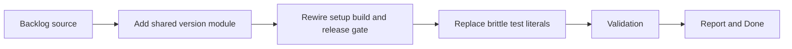

## task_027_centralize_mod_version_source_and_reduce_brittle_version_assertions - Centralize mod version source and reduce brittle version assertions
> From version: 3.0.17
> Status: Done
> Understanding: 100%
> Confidence: 95%
> Progress: 100%
> Complexity: Low
> Theme: Reliability
> Reminder: Update status/understanding/confidence/progress and dependencies/references when you edit this doc.

# Context
- Derived from backlog item `item_022_centralize_mod_version_source_and_reduce_brittle_version_assertions`.
- Source file: `logics/backlog/item_022_centralize_mod_version_source_and_reduce_brittle_version_assertions.md`.
- Related request(s): `req_023_centralize_mod_version_source_and_reduce_brittle_version_assertions`.

# Plan
- [x] 1. Clarify scope and acceptance criteria
- [x] 2. Implement changes
- [x] 3. Add/adjust tests and polish UX
- [x] FINAL: Update related Logics docs

# AC Traceability
- AC1 -> Step 1 and Step 2. Proof: `modules/version.mjs` and `setup.mjs`.
- AC2 -> Step 2. Proof: `build.sh`, `scripts/release_gate.py`, and `tests/test_release_gate.py`.
- AC3 -> Step 3. Proof: `tests/test_setup.mjs`, `tests/test_composition_root.mjs`, `tests/test_app_orchestrator.mjs`, `tests/test_contracts.mjs`.
- AC4 -> Validation. Proof: executed Node tests, Python release-gate tests, build run, and `logics` lint/audit.

# Links
- Backlog item: `item_022_centralize_mod_version_source_and_reduce_brittle_version_assertions`
- Request(s): `req_023_centralize_mod_version_source_and_reduce_brittle_version_assertions`

# Validation
- `node --test tests/test_setup.mjs tests/test_composition_root.mjs tests/test_app_orchestrator.mjs tests/test_contracts.mjs`
- `python3 -m unittest tests.test_release_gate -v`
- `bash build.sh`
- `python3 logics/skills/logics-doc-linter/scripts/logics_lint.py`
- `python3 logics/skills/logics-flow-manager/scripts/workflow_audit.py`

# Definition of Done (DoD)
- [x] Scope implemented and acceptance criteria covered.
- [x] Validation commands executed and results captured.
- [x] Linked request/backlog/task docs updated.
- [x] Status is `Done` and progress is `100%`.

# Report
- Added a dedicated shared version source in `modules/version.mjs`.
- Switched `setup.mjs` to import the shared version constant instead of owning its own literal.
- Updated `build.sh` and `scripts/release_gate.py` to derive the release version from the shared version module.
- Updated `tests/test_release_gate.py` to reflect the new source of truth.
- Replaced repeated hardcoded runtime version strings in the main Node tests with imports from the shared version module.
- Validation executed:
- `node --test tests/test_setup.mjs tests/test_composition_root.mjs tests/test_app_orchestrator.mjs tests/test_contracts.mjs`
- `python3 -m unittest tests.test_release_gate -v`
- `bash build.sh`
- `python3 logics/skills/logics-doc-linter/scripts/logics_lint.py`
- `python3 logics/skills/logics-flow-manager/scripts/workflow_audit.py`
