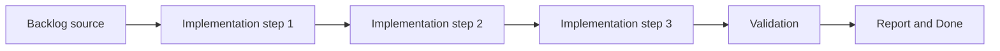

## task_028_fix_eta_level_prediction_labels_and_unknown_shared_notification_display - Fix ETA level prediction labels and unknown shared notification display
> From version: v3.0.17
> Status: Done
> Understanding: 95%
> Confidence: 95%
> Progress: 100%
> Complexity: Low
> Theme: UI
> Reminder: Update status/understanding/confidence/progress and dependencies/references when you edit this doc.

# Context
- Derived from backlog item `item_023_fix_eta_level_prediction_labels_and_unknown_shared_notification_display`.
- Source file: `logics/backlog/item_023_fix_eta_level_prediction_labels_and_unknown_shared_notification_display.md`.
- Related request(s): `req_024_fix_eta_level_prediction_labels_and_unknown_shared_notification_display`.

# Plan
- [x] 1. Clarify scope and acceptance criteria
- [x] 2. Implement changes
- [x] 3. Add/adjust tests and polish UX
- [x] FINAL: Update related Logics docs

# AC Traceability
- AC1 -> Prediction entries now carry `targetLevel`, and non-combat rendering prefers it over raw object keys. Proof: [etaDomain.mjs](/Users/alexandreagostini/Documents/cde/modules/etaDomain.mjs), [eta.mjs](/Users/alexandreagostini/Documents/cde/modules/eta.mjs), [nonCombatPanel.mjs](/Users/alexandreagostini/Documents/cde/pages/nonCombatPanel.mjs).
- AC2 -> Shared notification display filters `Unknown` entries before rendering. Proof: [notification.mjs](/Users/alexandreagostini/Documents/cde/modules/notification.mjs).
- AC3 -> Covered by [test_eta_domain.mjs](/Users/alexandreagostini/Documents/cde/tests/test_eta_domain.mjs), [test_panels.mjs](/Users/alexandreagostini/Documents/cde/tests/test_panels.mjs), [test_notification.mjs](/Users/alexandreagostini/Documents/cde/tests/test_notification.mjs).

# Links
- Backlog item: `item_023_fix_eta_level_prediction_labels_and_unknown_shared_notification_display`
- Request(s): `req_024_fix_eta_level_prediction_labels_and_unknown_shared_notification_display`

# Validation
- `node --test tests/test_eta_domain.mjs tests/test_panels.mjs tests/test_notification.mjs`
- `node --test tests/test_pages_runtime.mjs tests/test_pages_module.mjs tests/test_setup.mjs tests/test_composition_root.mjs tests/test_app_orchestrator.mjs tests/test_contracts.mjs tests/test_cloud_storage.mjs`

# Definition of Done (DoD)
- [x] Scope implemented and acceptance criteria covered.
- [x] Validation commands executed and results captured.
- [x] Linked request/backlog/task docs updated.
- [x] Status is `Done` and progress is `100%`.

# Report
- Corrected the ETA prediction data contract so predicted rows retain an explicit `targetLevel` alongside the XP cap used for calculations.
- Updated non-combat panel rendering to show target levels for both skill and mastery predictions.
- Added a defensive display filter to suppress invalid shared notification owners such as `Unknown`.
- Validation completed with targeted ETA/panel/notification tests plus a broader Node regression pass.
